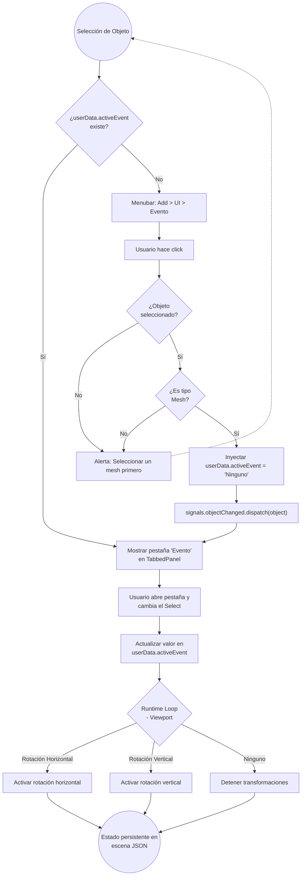
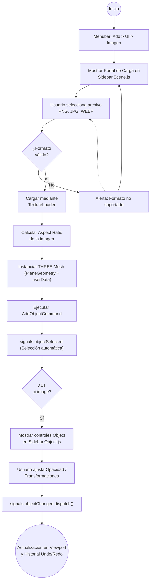

# Segunda Prueba Técnica - Naddie

---

Para observar el ejercicio, ingrese al siguiente enlace: [Prueba Técnica](https://velkez.github.io/naddie-prueba-tecnica-2/editor/)

Guía de Uso

## Botón (Evento)

Para utilizar la funcionalidad de eventos, primero diríjase a la barra superior de opciones y posicione el cursor sobre la sección Add. Se desplegará un menú con múltiples opciones de adición; allí, navegue hasta la subsección UI y haga clic en la opción Evento, tal como se ilustra a continuación:

Para activar esta opción, es indispensable tener un Mesh (malla) seleccionado en la escena. De lo contrario, el sistema mostrará una alerta indicando que debe seleccionar un objeto primero.

Una vez seleccionado el objeto y habilitada la funcionalidad, aparecerá una nueva pestaña llamada Eventos en la barra lateral (sidebar). Haga clic en ella para acceder a la configuración:

Dentro del menú desplegable, encontrará tres opciones: Rotación Horizontal, Rotación Vertical y Ninguno. Al seleccionar cualquiera de ellas, el objeto ejecutará la acción descrita de forma inmediata y persistente.

## Imagen

Para utilizar la funcionalidad de imagen, diríjase nuevamente a la barra superior de opciones en la sección Add. Dentro de la subsección UI, seleccione la opción Imagen:

Tras activarla, aparecerá un botón de carga en el panel lateral que le permitirá importar la imagen de su preferencia:

Al interactuar con este botón, se abrirá el gestor de archivos de su dispositivo. Los formatos admitidos son PNG, JPG y WEBP. Una vez seleccionada, la imagen se cargará en la escena como un objeto con geometría plana (PlaneGeometry), el cual ajustará sus dimensiones automáticamente según la proporción original de la imagen.

Como cualquier otro objeto en la escena, podrá modificar sus propiedades de transformación (posición, rotación y escala) libremente:

Además, también tendrá la posibilidad de aplicar eventos de animación a la imagen siguiendo los mismos pasos descritos en la sección anterior.

---
## Desglosé del problema

Este proyecto hace parte de una prueba técnica, en la cual nos pide hacer implementaciones desde un proyecto ya existente, este es el editor oficial de la librería ThreeJS. En la cual se nos pide hacer lo siguiente lo siguiente:

En la barra superior de opciones, podemos encontrar opciones como `File`, `Edit`, `Add`, `View`, `View` y `Render`. La prueba pide enfocarnos en la sección de `Add`, la cual despliega un conjunto de sub-secciones con opciones múltiples de adición a la `Scene`. Debajo de estas sub-secciones se agregó una nueva, cuyo nombre es `UI`. Este tiene dos opciones incluidas llamadas `Botón` e `Imagen`. A continuación se describe que hace cada sección:

---
### Botón (Evento)

Esta opción tuvo un cambio de nombre para que sea mas entendible su propósito, por lo tanto se llamó `Evento`. Esta opción posee un panel con el mismo nombre dentro del div `#properties.TabbedPanel` con el objetivo de que únicamente aparezca y pueda ser "invocado" cuando un mesh en la escena haya sido seleccionado, tal y como pasa con las pestañas de `Object`, `Geometry`, `Material` y `Script`.

Una vez seleccionado un mesh, en un principio, la pestaña con el panel `Evento` no aparecerá como las opciones mencionadas anteriormente; para que aparezca, se deberá seleccionar la opción `Evento` en la sección `Add/UI/Evento` de la barra de opciones ubicado en la parte superior del editor. En validación, la opción `Evento` no aparecerá en los mesh donde no se le ha "asignado", esta opción tiene una vinculación directa con el `UUID` del mesh al que se le haga lo descrito previamente.

El panel contiene un elemento `span` con el nombre de la opción, y un elemento `select` que proporciona las opciones de eventos. Las opciones de evento tienen 3 acciones que afectan al mesh al que esta vinculado: `Ninguno` (no activa ninguna acción), `Rotación Horizontal` (hace que el mesh rote horizontalmente sobre su eje Y), y `Rotación Vertical` (hace que el mesh rote verticalmente sobre su eje X).

**Consideraciones implementadas:** 
- La opción `Evento` está únicamente disponible en los mesh, esto quiere decir que no es invocable en `Light` o `Camera`.
- Al hacerle click a la opción de `Evento` en la barra superior de opciones, el sistema valida si un mesh esta seleccionado, en caso de que no sea así, se le informa al usuario por medio de una alerta que debe seleccionar un mesh de la escena.
- El evento seleccionado persiste en el mesh aunque este seleccionado, por ejemplo: Si el usuario selecciona `Rotación Horizontal`, y luego selecciona otro mesh para aplicar otro evento, el mesh al que se le activó ese evento antes mencionado, persiste activo hasta que el usuario manualmente lo desactiva con la opción `Ninguno`.
- No se guarda el estado del evento solo en la UI. El `UUID` del mesh actúa como llave en el objeto `userData` del mesh.
- El `select` actualiza el valor en `userData.activeEvent`. Luego, en la función de renderizado del Viewport se consulta ese valor para aplicar la transformación.
- Si el usuario elimina un mesh que tiene `Evento` vinculado, el sistema limpia automáticamente ya que el panel solo se muestra cuando existe `userData.activeEvent`.

Para garantizar la integridad del Editor y la persistencia de los datos, la implementación de la sección **UI / Evento** se rigió por los siguientes lineamientos técnicos:

#### 1. Persistencia y Vinculación (Data Binding)

La vinculación del evento con el **UUID** del Mesh se realizó mediante el objeto `userData` nativo de Three.js.
- **Propiedad:** Se creó una clave `userData.activeEvent` en el objeto seleccionado.
- **Valores permitidos:** `null` (por defecto), `'Ninguno'`, `'Rotación Horizontal'`, `'Rotación Vertical'`.
- **Justificación:** El uso de `userData` garantiza que el evento persista si la escena es exportada o guardada en formato JSON, cumpliendo con el requisito de persistencia mencionado en la prueba.

#### 2. Gestión de la Interfaz (Sidebar & TabbedPanel)

El panel **Evento** se integró en el ciclo de vida de la barra lateral (`Sidebar.js`):
- **Inyección de Componente:** Se creó el módulo `Sidebar.Event.js` que hereda de la clase `UI.Panel`.
- **Visibilidad Dinámica:** El panel escucha la señal `signals.objectSelected`.
    - Si el objeto es un `Mesh` **Y** posee la propiedad `userData.activeEvent`, el panel ejecuta `.setDisplay( 'block' )`.
    - En cualquier otro caso (Cámaras, Luces o Meshes sin el flag activo), ejecuta `.setDisplay( 'none' )`.
- **Activación desde Menú:** Al hacer clic en `Add > UI > Evento`, se injectó la propiedad inicial `userData.activeEvent = 'Ninguno'` al objeto seleccionado y se disparó la señal `signals.objectChanged.dispatch( object )` para forzar la actualización de la UI.

#### 3. Motor de Animación (Runtime)

Las opciones **Rotación Horizontal** y **Rotación Vertical** requieren cambios en tiempo real, la lógica no reside en el panel de la interfaz, sino en el bucle de renderizado del editor (`Viewport.js`):
- **Rotación Horizontal:** Se aplica un incremento constante al eje Y.
- **Rotación Vertical:** Se aplica un incremento constante al eje X.
- **Optimización:** El motor de renderizado solo aplica estas transformaciones a los objetos cuyo `userData.activeEvent` sea distinto de `'Ninguno'`.
- **Control de transformación:** La animación se pausa únicamente cuando el usuario está activamente transformando el objeto (arrastrando con el mouse), no cuando simplemente está seleccionado. Esto se logra mediante un flag `transformControlsDragging` que se activa en el evento `mouseDown` del `TransformControls` y se desactiva en `mouseUp`.

#### 4. Validaciones de Seguridad

- **Check de Selección:** Antes de proceder con la activación desde el menú superior, el sistema valida: `if ( editor.selected === null || !editor.selected.isMesh )`.
- **Notificación:** Si la validación falla, se invoca el sistema de alertas nativo del navegador o del editor para interrumpir el flujo.

---

### Imagen

Para la implementación de la entidad **Imagen**, se extendió el comportamiento del núcleo del editor para soportar objetos bidimensionales dentro del espacio tridimensional, siguiendo estas directrices:

#### 1. Inyección en el Panel de Escena (Scene Sidebar)

A diferencia de los eventos, la interfaz de **Imagen** se integró de forma persistente en el panel de Scene (`Sidebar.Scene.js`):

- **Estructura DOM:** Se insertó un nuevo contenedor `UI.Row` debajo de las propiedades globales de la escena.
- **Separación:** Se utilizó un elemento ` ` para delimitar visualmente esta sección de los parámetros estándar de renderizado (Fog, Background, etc.).
- **Activador de Carga:** El panel contiene un componente `UI.Input` de tipo `file` que muestra un gráfico/icono de "Upload". Este solo es funcional una vez activada la opción desde el menú superior.

#### 2. Comportamiento de Instanciación

Al seleccionar `Add > UI > Imagen`, se habilita el flujo de carga:

- **Entidad en Escena:** Una vez que el usuario selecciona un archivo local, el sistema no solo muestra la imagen en el panel, sino que instancia un objeto de clase `THREE.Mesh` (con geometría `PlaneGeometry`).
- **Manejo de Texturas:** El archivo cargado se convierte en una `THREE.Texture`. Se utilizó `TextureLoader` para asignar el mapa de bits al material del objeto recién creado.
- **Material:** El material se crea con las propiedades `transparent: true` y `opacity: 1` para permitir el control de opacidad.
- **Transformaciones Estándar:** El objeto resultante posee todas las propiedades de un `Object3D`. Esto permite que el usuario utilice los transformadores nativos del editor (Translation, Rotation, Scale) mediante los controles de teclado o las flechas del viewport.

#### 3. Flujo de Trabajo y Jerarquía

- **Jerarquía de Objetos:** La imagen instanciada aparece en el `Outliner` (árbol de objetos) como cualquier otro Mesh, permitiendo su selección y edición individual.
- **Validación de Carga:** El sistema valida que el archivo sea un formato de imagen compatible (JPG, PNG, WebP) antes de intentar la creación del objeto en la escena para evitar errores de renderizado.
- **Nombrado:** Las imágenes se nombran secuencialmente como "Imagen 1", "Imagen 2", etc.

La funcionalidad de `Imagen` se dividió en dos fases: Activación y Gestión.

#### 4. Fase de Activación (Panel Scene)

El panel de Scene (`Sidebar.Scene.js`) actúa exclusivamente como el punto de entrada para la creación de nuevos elementos visuales.

- **Componente "Portal":** Se injectó un `UI.Row` que contiene un botón de carga. Este componente se mantiene oculto hasta que el usuario lo invoca mediante el menú `Add > UI > Imagen`.
- **Disparador de Instancia:** Al cargar un archivo a través de este portal, el sistema ejecutó un comando de creación (`Editor.execute( new AddObjectCommand( ... ) )`).
- **Creación del Objeto:** Se instanciò un `THREE.Mesh` con una `THREE.PlaneGeometry` cuyas proporciones (aspect ratio) se ajustan automáticamente a las dimensiones de la imagen cargada.

#### 5. Fase de Gestión (Panel Object)

Una vez que el objeto "Imagen" existe en la escena y está seleccionado, su configuración detallada se trasladó al panel de Propiedades de Objeto (`Sidebar.Object.js`).

- **Contextualización:** El panel de Objeto detecta mediante la propiedad `object.userData.type === 'ui-image'` que se trata de una entidad de tipo Imagen.
- **Controles Específicos:** Se habilitó una sección dentro de `Sidebar.Object.js` que permite:
    - **Ajuste de Opacidad:** Un slider para controlar la transparencia del material (`Material.opacity`).
- **Coherencia Visual:** Esto permite que el usuario use las pestañas nativas de _Geometry_ y _Material_ para ajustes técnicos, mientras que la configuración específica de la "Imagen" reside en la pestaña principal de _Object_.

#### 6. Flujo de Señales (Signals)

- **Actualización en Tiempo Real:** Se utilizó la señal `signals.objectChanged` para asegurar que cualquier cambio en la imagen se refleje inmediatamente en el Viewport y en el historial de "Undo/Redo".
- **Selección Automática:** Inmediatamente después de la carga exitosa desde el panel Scene, el sistema fuerza la selección del nuevo objeto (`editor.select( mesh )`) para que el usuario sea redirigido visualmente al panel de gestión de objetos.

