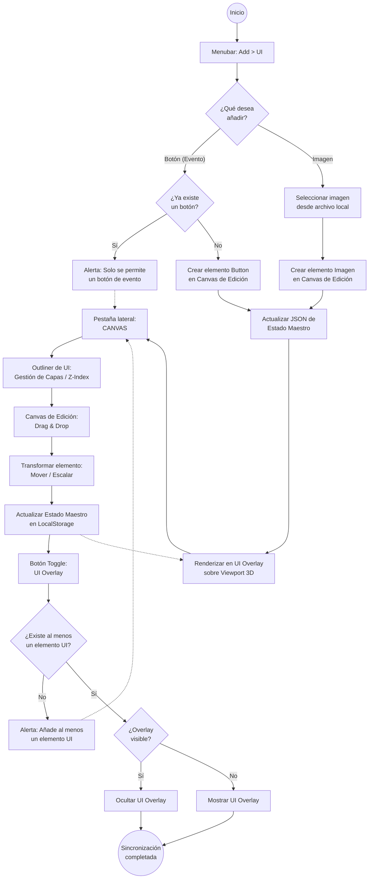

# Prueba Técnica: Sistema de Interfaz de Usuario 2D para Three.js Editor


Para probar las funciones nuevas haga click en el siguiente enlace: [Prueba Técnica](https://velkez.github.io/naddie-prueba-tecnica-2/editor/)

## 1. Visión General

Este proyecto consiste en una extensión del editor oficial de Three.js para integrar un sistema de diseño de interfaz de usuario (UI) 2D independiente del espacio 3D. La implementación permite crear, gestionar y persistir elementos visuales (Botones e Imágenes) mediante una capa de superposición (UI Overlay) sobre el viewport principal, gestionada a través de un entorno de autoría interactivo integrado en el sidebar.

---

## 2. Arquitectura de Componentes

### 2.1 UI Overlay (Capa de Visualización)

El UI Overlay es la capa de visualización final que se renderiza sobre el canvas de WebGL (ThreeJS).

- **Naturaleza**: Es un elemento DOM posicionado de forma absoluta sobre el canvas de Three.js.
- **Función**: Mostrar al usuario final los elementos de UI (botones e imágenes) tal como se verían en una aplicación web convencional.
- **Coordenadas**: Utiliza un sistema normalizado (0% a 100%) heredado del Estado Maestro, garantizando que la disposición sea responsiva ante cambios en el tamaño de la ventana del navegador.
- **Cuadro de Visualización**: El contenido del canvas UI se renderiza dentro de un cuadro centrado en el overlay, con una proporción de **4:3**. Este cuadro representa el área visible donde se mostrará la interfaz diseñada.

### 2.2 Panel de Control (Sidebar Tab)

Para mantener la Separación de Incumbencias (Separation of Concerns), se añade una nueva pestaña denominada **CANVAS** en el `#sidebar`, situada junto a la pestaña de **SCENE**.

- **Objetivo**: Disociar las herramientas de control 3D de las herramientas de diseño 2D, proporcionando un espacio de trabajo dedicado exclusivamente a la UI.

### 2.3 Canvas de Edición (Sidebar)

Dentro del panel lateral de CANVAS, se encuentra el área de edición interactiva. Este canvas escalada sirve como superficie de diseño directa.

- **Disposición del Panel**: El panel de CANVAS se organiza de la siguiente manera: el **Outliner de UI** se encuentra ubicado en la parte superior, seguido por el **Canvas de Edición** debajo. Esta jerarquía visual permite al usuario ver primero la lista de elementos y luego interactuar con el área de diseño.
- **Redimensionamiento Dinámico**: El canvas de edición ajusta su tamaño en función del ancho del sidebar. Cuando el sidebar se vuelve más estrecho, el canvas se reduce proporcionalmente; cuando el sidebar se ensancha, el canvas aumenta su tamaño. Sin embargo, **la proporción horizontal (4:3)** se mantiene constante en todo momento. Esta restricción garantiza que la correspondencia con el UI Overlay sea coherente y que el Estado Maestro no sufra disrupciones al calcular las coordenadas normalizadas de los elementos.
- **Interactividad Directa (Drag & Drop)**: El usuario puede hacer clic sobre los elementos (Botón/Imagen) y arrastrarlos para definir su posición.
- **Reflejo en Tiempo Real (Mirroring)**: Cualquier cambio de posición, tamaño o jerarquía realizado en el canvas de edición se refleja instantáneamente en el UI Overlay del viewport principal.
- **Gestión de Profundidad (Z-Index)**: La jerarquía en el outliner determina el orden de superposición. El último elemento en la lista es el que se renderiza por encima de los demás.
- **Nota de Implementación**: Dado que se utiliza `position: absolute` en el DOM del overlay, el orden de renderizado corresponde directamente al orden de los nodos HTML. El Outliner deberá reordenar los nodos DOM del overlay para reflejar la jerarquía visual, sin necesidad de utilizar la propiedad CSS `z-index`.
- **Sistema de Proyección**: El canvas del sidebar mantiene una relación de aspecto fija de **4:3**. Esta proporción es idéntica a la del cuadro de visualización en el UI Overlay, asegurando una correspondencia 1:1 entre las coordenadas del canvas de edición y el overlay. Al mantener esta proporción constante, se evitan distorsiones al trasladar coordenadas normalizadas entre ambos espacios.
- **Transformadores de Selección**: Al seleccionar un elemento, aparecen controles visuales (handlers) para permitir el escalado manual.

### 2.4 Outliner de UI

Dentro del panel lateral de CANVAS, se implementa un `#outliner` especializado:

- **Feedback Visual**: Lista todos los elementos activos en la interfaz.
- **Interactividad**: Soporta Drag & Drop para reordenar los elementos y, por ende, su prioridad visual en el canvas.

### 2.5 Botón de Activación del Overlay (UI Toggle)

Para permitir al usuario previsualizar el resultado final, se implementa un botón de activación del UI Overlay.

- **Posicionamiento**: El botón debe estar ubicado al mismo nivel jerárquico que `#viewport` y `#toolbar` en la estructura DOM del editor. Se sitúa en la esquina inferior derecha, adyacente al `#sidebar`, respetando su espacio sin superponerse (similar al posicionamiento del `#viewhelper`).
- **Estado Inicial**: El UI Overlay permanece oculto por defecto. El usuario debe activar manualmente la visualización.
- **Validación de Contenido**: Al intentar activar el overlay, el sistema verifica la existencia de al menos un elemento UI (imagen o botón). Si no existe ningún elemento, el sistema muestra una alerta indicando que debe añadir al menos un elemento antes de visualizar el overlay.
- **Comportamiento**: Al presionar el botón, se alterna la visibilidad del UI Overlay sobre el viewport 3D.

---

## 3. Elementos de la Interfaz

### 3.1 Imágenes

- **Cantidad**: Ilimitada; el usuario puede instanciar tantas imágenes como requiera.
- **Gestión**: Cada imagen es una entidad independiente con sus propias coordenadas, tamaño y fuente de datos.
- **Consideraciones:** Al añadir una imagen desde `Add/UI/Imagen`, el sistema abrirá el navegador de archivos local del usuario para directamente seleccionar la imagen a añadir en el canvas de edición UI.

### 3.2 Botón (Evento)

- **Restricción de Unicidad**: El sistema permite **un solo botón** en el canvas.
- **Validación**: Al intentar añadir un botón desde el menú `Add > UI > Botón`, el sistema verifica la existencia de uno previo. Si ya existe, se deniega la acción; si no, se permite su creación.
- **Funcionalidad**: Actúa como el disparador de un evento lógico predeterminado hacia el canvas 3D (Three.js).
- **Acción del Evento:** El evento será agregar una `DirectionalLight` en el canvas WebGL (ThreeJS) y que esta cambie de colores periódicamente por el rango de tiempo de 1 segundo. Los colores serían los RGB: `Red`, `Green` y `Blue` los cuales se irán cambiando "aleatorio"
- **Nota de Implementación:** El cambio de colores debe gestionarse mediante `THREE.Clock` o `requestAnimationFrame` para garantizar una animación fluida e independiente de la velocidad del procesador.
- **Desactivar Evento:** El usuario, al darle nuevamente al botón hará que la `DirectionalLight` se borré del canvas WebGL (ThreeJS)

---

## 4. Interacción y UX (User Experience)

### 4.1 Activación de Selección

Al seleccionar un elemento en el Outliner o en el Canvas de Edición, se activará un **"Bounding Box"** (borde azul o puntos de control) sobre el elemento correspondiente. Esto permite al usuario identificar inequívocamente el objeto en edición.

- **Nota de Implementación**: El Bounding Box es una entidad puramente visual del editor y **no forma parte del Estado Maestro**. No debe incluirse en el JSON de persistencia, ya que solo existe durante la sesión de edición para facilitar la identificación del elemento seleccionado.

### 4.2 Manipulación

Los elementos pueden ser ubicados y redimensionados dentro del espacio dispuesto por el canvas de edición.

### 4.3 Sincronización Bidireccional

1. El usuario mueve un elemento en el Canvas de Edición.
2. El "Estado Maestro" (JSON) se actualiza.
3. El UI Overlay lee el nuevo estado y reposiciona el elemento.

### 4.4 Lógica de Comunicación (Signals)

Se implementará un flujo de señales específico para este proceso:

- `signals.uiElementTransformed`: Se dispara mientras el usuario arrastra un objeto en el canvas de edición.
- `signals.uiStatePersisted`: Se dispara al soltar el elemento, activando el guardado en el Local Storage.

---

## 5. Persistencia y Estado Maestro

Para garantizar que el diseño no se pierda al recargar el editor, se implementa un sistema de Estado Maestro centralizado:

- **Sincronización**: El estado se guarda en el Local Storage del navegador en formato JSON, replicando el comportamiento nativo del editor de Three.js.

### 5.1 Estructura del JSON de Estado

```json
{
  "canvas": {
    "elements": [
      { 
        "id": "img_1", 
        "type": "image", 
        "pos": [10, 20], 
        "size": [100, 100], 
        "src": "base64_or_url..." 
      },
      { 
        "id": "btn_1", 
        "type": "button", 
        "pos": [50, 50], 
        "event": "rotation" 
      }
    ]
  }
}
```

---

## 6. Consideraciones Técnicas de Implementación

### 6.1 Gestión de Colisiones

Como el canvas del sidebar es pequeño, los elementos pueden ser difíciles de agarrar. Se debe definir un área de colisión (padding) un poco más grande que el elemento visual para facilitar el "drag".

### 6.2 Optimización de Actualización

No se debe actualizar el JSON del Local Storage en cada píxel que el usuario mueva el mouse (eso es costoso). Se debe actualizar el UI Overlay en tiempo real, pero guardar en el Local Storage solo cuando el usuario suelte el elemento (mouseup).

---

## 7. Flujo de Trabajo del Usuario

1. **Adición**: El usuario accede a la barra superior `Add > UI` para elegir entre Botón o Imagen.
2. **Selección de Imagen**: Si elige Imagen, el sistema abre el navegador de archivos local para seleccionar la imagen.
3. **Validación de Botón**: Si elige Botón, el sistema verifica si ya existe uno. Si existe, muestra alerta y cancela; si no, crea el elemento.
4. **Renderizado Inicial**: El elemento se renderiza en el Canvas de Edición del sidebar y se actualiza el Estado Maestro.
5. **Edición**: El usuario arrastra los elementos en el Canvas de Edición para posicionar y redimensionar.
6. **Selección**: Al seleccionar un elemento, se muestra el Bounding Box visual para identificarlo.
7. **Gestión de Capas**: El usuario reordena los elementos en el Outliner para controlar el Z-Index (orden de superposición).
8. **Activación del Overlay**: El usuario presiona el botón de toggle en la esquina inferior derecha.
   - Si no hay elementos UI, el sistema muestra alerta.
   - Si existen elementos, alterna la visibilidad del UI Overlay.
9. **Persistencia**: Cualquier cambio actualiza automáticamente el JSON en el Local Storage.




## 8. Adicionales

Debido a un al entendido se desarrollo otras funcionalidades en una iteración pasada, sin embargo se considero conservarlas ya que de cierto modo son "divertidas" y también para no desechar ese trabajo que se hizo anteriormente. y esta se conserve en el sub-menú `Other`, el cual añade una imagen en el canvas 3D y aparte también añade interacción de eventos de rotación vertical y horizontal de meshes individuales. Para leer la documentación y la guía de uso sobre estas funcionalidades, puede navegar al siguiente enlace: [Otros](./docs/other.md)
